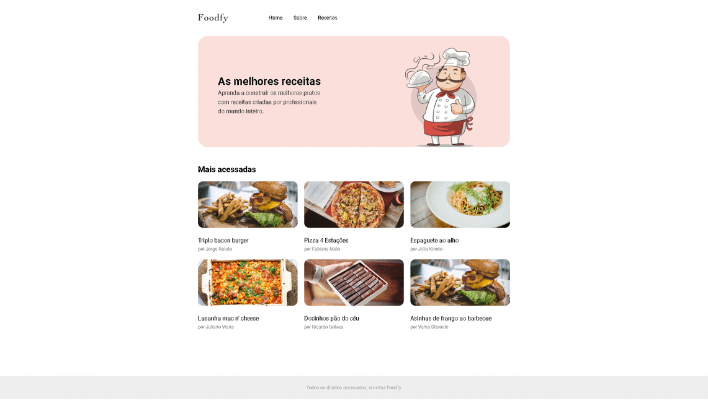

<h4 align="center"> 
	 :hamburger:&nbsp;&nbsp;&nbsp;&nbsp;Foodfy&nbsp;:hamburger:
</h4>

  
  
      

    
## What's Foodfy?

Foodfy is a simple platform that i created to train some technologyes, following a challenge proposed by Rocketseat!  :rocket:

 
    

## :rocket:&nbsp;&nbsp;&nbsp; Technologies

- CSS
- JavaScript (for dom controller)
- HTML5

Made with ♥ by Daniel Cruz [daanielcruz~] :wave: &nbsp;&nbsp;&nbsp;[Get in touch!](https://www.linkedin.com/in/danielfercruz/)
